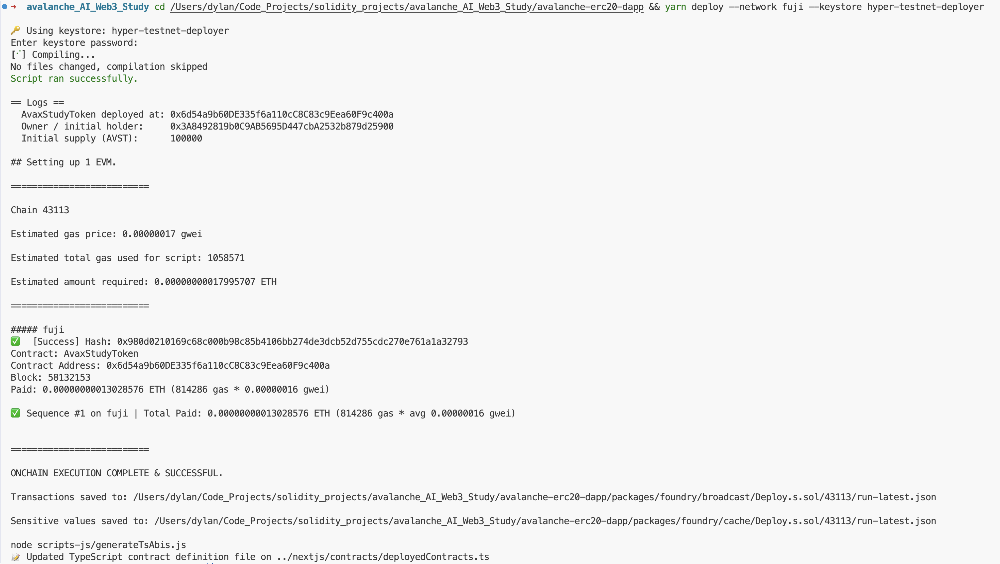
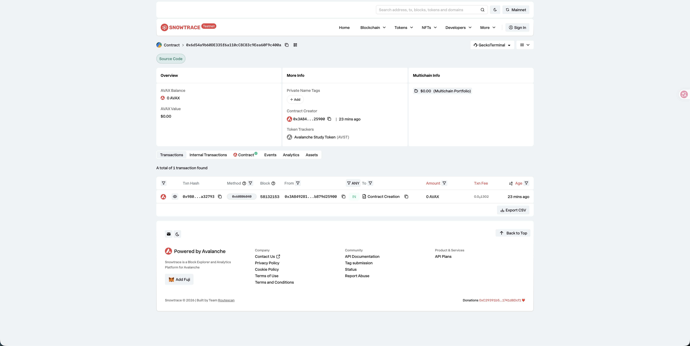
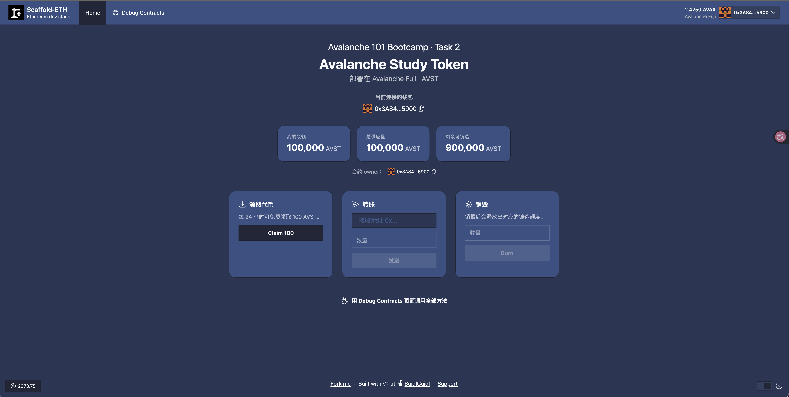

# Task 2：第二章 Vibe Coding 开发你的第一个 DApp

> 对应课程：第二章
> 截止提交：9月6日 24:00:00 (UTC+8)

## 任务目标

掌握 Vibe Coding 技巧，用 Scaffold-ETH 自己部署 ERC20 合约的应用。

## 成果

| 项目 | 内容 |
| --- | --- |
| 网络 | Avalanche Fuji 测试网（chainId `43113`） |
| 合约名 | `AvaxStudyToken` |
| 代币 | Avalanche Study Token（AVST），18 位小数 |
| **合约地址** | [`0x6d54a9b60DE335f6a110cC8C83c9Eea60F9c400a`](https://testnet.snowtrace.io/address/0x6d54a9b60DE335f6a110cC8C83c9Eea60F9c400a) |
| Snowtrace | https://testnet.snowtrace.io/address/0x6d54a9b60DE335f6a110cC8C83c9Eea60F9c400a （源码已验证） |
| 部署交易 | [`0x980d0210169c68c000b98c85b4106bb274de3dcb52d755cdc270e761a1a32793`](https://testnet.snowtrace.io/tx/0x980d0210169c68c000b98c85b4106bb274de3dcb52d755cdc270e761a1a32793) |
| 开发框架 | Scaffold-ETH 2（Foundry 版本）+ OpenZeppelin 5.7 |
| 部署者 / owner | `0x3A8492819b0C9AB5695D447cbA2532b879d25900` |

## 合约设计

基于 OpenZeppelin 的 `ERC20` + `ERC20Burnable` + `Ownable`，在标准 ERC20 之上加了三件事：

| 能力 | 说明 |
| --- | --- |
| 总量硬上限 | `MAX_SUPPLY = 1,000,000 AVST`，owner 也无法超发 |
| owner 铸造 | `mint(to, amount)`，受上限约束 |
| 公开水龙头 | `claim()` 任何人可领 `100 AVST`，冷却 24 小时 |
| 销毁 | `burn(amount)`，销毁后释放出对应的铸造额度 |

部署时向部署者铸造 `100,000 AVST` 作为初始供应。

```solidity
contract AvaxStudyToken is ERC20, ERC20Burnable, Ownable {
    uint256 public constant MAX_SUPPLY = 1_000_000 * 10 ** 18;
    uint256 public constant CLAIM_AMOUNT = 100 * 10 ** 18;
    uint256 public constant CLAIM_COOLDOWN = 1 days;

    mapping(address => uint256) public lastClaimedAt;

    function claim() external {
        uint256 last = lastClaimedAt[msg.sender];
        if (last != 0) {
            uint256 availableAt = last + CLAIM_COOLDOWN;
            if (block.timestamp < availableAt) revert ClaimTooSoon(availableAt);
        }
        lastClaimedAt[msg.sender] = block.timestamp;
        _mintChecked(msg.sender, CLAIM_AMOUNT);
        emit Claimed(msg.sender, CLAIM_AMOUNT);
    }
}
```

## 部署截图




## Snowtrace 链上合约




## DApp 前端




## 测试

18 个 Foundry 测试全部通过（含 2 个 fuzz 测试），覆盖元数据、初始供应、转账/授权、owner 权限、总量上限边界、claim 冷却和 burn 释放额度：

```
Ran 18 tests for test/AvaxStudyToken.t.sol:AvaxStudyTokenTest
...
Suite result: ok. 18 passed; 0 failed; 0 skipped
```

## 关键改动

把 Scaffold-ETH 2 接到 Avalanche 只改了两个文件：

`packages/foundry/foundry.toml`
```toml
[rpc_endpoints]
fuji = "https://api.avax-test.network/ext/bc/C/rpc"

[etherscan]
fuji = { key = "${SNOWTRACE_API_KEY}", chain = 43113, url = "https://api.routescan.io/v2/network/testnet/evm/43113/etherscan" }
```

`packages/nextjs/scaffold.config.ts`
```ts
targetNetworks: [chains.avalancheFuji, chains.foundry],
rpcOverrides: {
  [chains.avalancheFuji.id]: "https://api.avax-test.network/ext/bc/C/rpc",
},
```

## 踩坑记录

1. `create-eth` 要求 Foundry ≥ 1.4.0，本机是 1.2.3，先跑 `foundryup` 升级才能创建项目。
2. OpenZeppelin 5.x 的 `Ownable` 构造函数必须显式传 `initialOwner`，不再默认取 `msg.sender`。
3. 前端 lint 报 `react-hooks/purity`：render 阶段直接调 `Date.now()` 算 claim 冷却不被允许（也会造成 SSR 水合不一致），要挪进 `useEffect` 用 state 存。
4. Fuji 的合约验证走 Routescan 的免费端点即可，不需要申请 Snowtrace API key。
