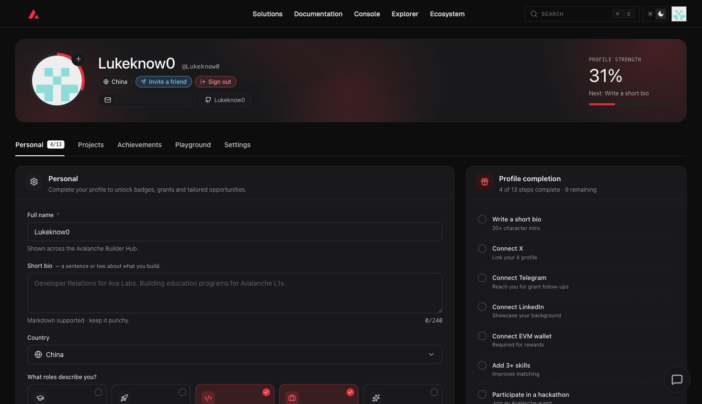
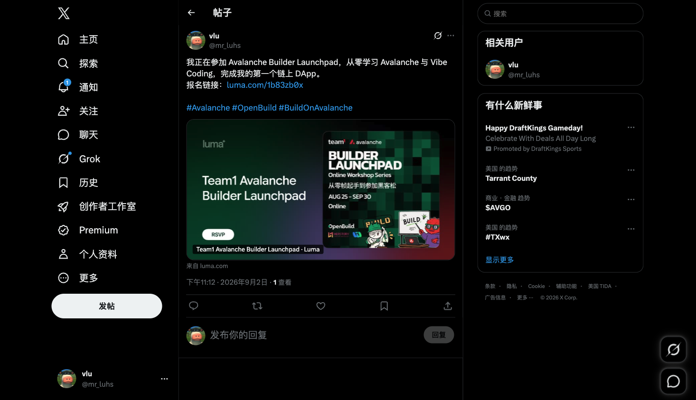

# Task 1：第一章 Avalanche 零基础入门知识

> 对应课程：第一章
> 截止提交：9 月 6 日 24:00:00（UTC+8）

## 任务目标

### 任务一：Builder Hub 注册完成截图

已使用 Builder Hub 完成注册。

### 任务二：公开分享课程报名链接

已在 X 公开分享官方课程报名链接：<https://x.com/mr_luhs/status/2095168027516109037>

## 提交说明

- GitHub 用户名：`Lukeknow0`
- 作业内容仅包含本人提交的证明材料。
