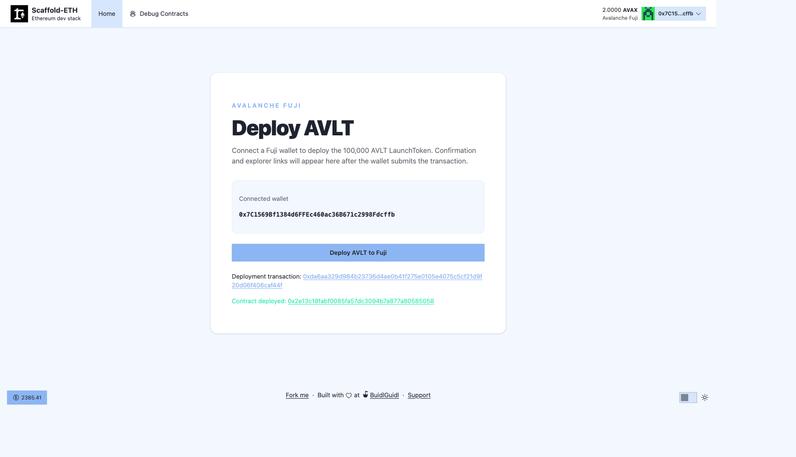

# Task 2：第二章 Vibe Coding 开发你的第一个 DApp

> 对应课程：第二章
> 截止提交：9 月 6 日 24:00:00 (UTC+8)

## 任务目标

使用 Scaffold-ETH 2 和 AI Vibe Coding 完成 ERC20 合约，并部署到 Avalanche Fuji 测试网。

## 部署结果

| 项目 | 内容 |
| --- | --- |
| 网络 | Avalanche Fuji Testnet（Chain ID `43113`） |
| 合约 | Avalanche Launch Token（`AVLT`） |
| 初始发行量 | `100,000 AVLT` |
| 部署账户 | `0x7c1569bf1384d6ffec460ac36b671c2998fdcffb` |
| 合约地址 | `0x2e13c18fabf0085fa57dc3094b7a877a80585058` |
| 部署交易 | `0xda6aa329d984b23736d4ae0b41f275e0105e4075c5cf21d9f20d06f406caf44f` |
| 部署区块 | `58143963` |
| 交易状态 | 成功（`0x1`） |

- [Fuji 合约页面](https://testnet.snowtrace.io/address/0x2e13c18fabf0085fa57dc3094b7a877a80585058)
- [Fuji 部署交易](https://testnet.snowtrace.io/tx/0xda6aa329d984b23736d4ae0b41f275e0105e4075c5cf21d9f20d06f406caf44f)

## 部署成功截图

## 链上验证

Fuji 公共 RPC 返回的交易回执状态为 `0x1`，合约地址存在字节码；读取到合约名称 `Avalanche Launch Token`、符号 `AVLT`、总供应量 `100,000 AVLT`。

## 截止时间

9 月 6 日 24:00:00 (UTC+8)
