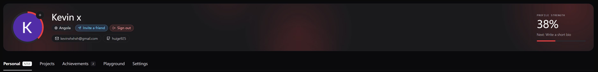
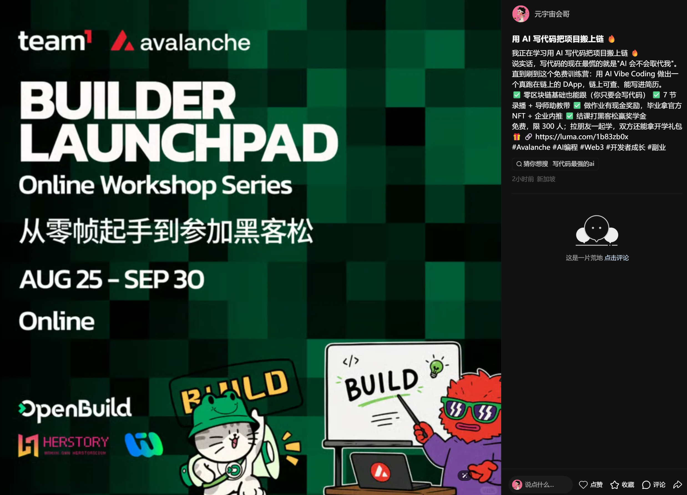

# Task 1：第一章 Avalanche 零基础入门知识

> 对应课程：第一章
> 截止提交：9 月 6 日 24:00:00（UTC+8）

## 任务一：注册 BuilderHub

已完成 Avalanche BuilderHub 注册，GitHub 用户名为 `huige925`。

## 任务二：转发课程报名链接

已将课程报名链接 https://luma.com/1b83zb0x 转发至小红书。

## 学习收获

Avalanche 的 C-Chain 兼容 EVM，因此可以复用 Solidity、OpenZeppelin 和常见以太坊开发工具。通过配置 Fuji 测试网 RPC 与 chainId `43113`，就能完成从合约开发到测试网部署的完整流程。

Avalanche 的自定义 L1 能在链级别配置验证者、Gas 代币与准入规则，适合对性能、合规和业务逻辑有定制要求的真实应用场景。
