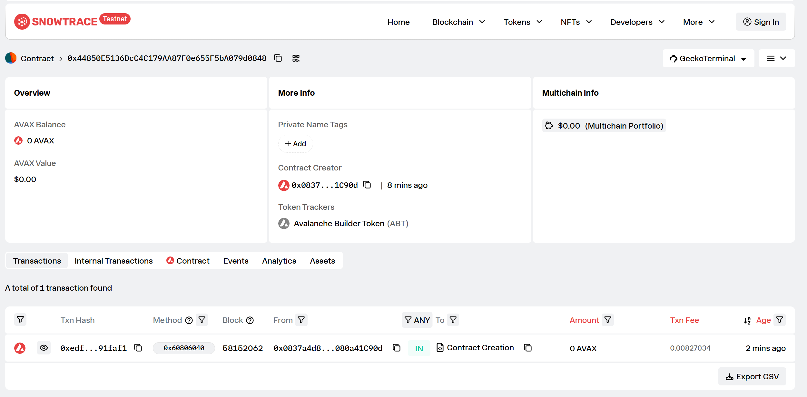

# Task 2：第二章 Vibe Coding 开发你的第一个 DApp

> 对应课程：第二章
> 截止提交：9 月 6 日 24:00:00（UTC+8）

## 任务成果

使用 Scaffold-ETH 2（Hardhat）与 OpenZeppelin 在 Avalanche Fuji 测试网部署 ERC20 合约。

| 项目 | 内容 |
| --- | --- |
| 网络 | Avalanche Fuji Testnet（chainId `43113`） |
| 合约名 | `AvalancheBuilderToken` |
| 代币名称 | Avalanche Builder Token（ABT） |
| 初始供应量 | 1,000,000 ABT（18 位小数） |
| 合约地址 | [`0x44850e5136dcc4c179aa87f0e655f5ba079d0848`](https://testnet.snowtrace.io/address/0x44850e5136dcc4c179aa87f0e655f5ba079d0848) |
| 部署交易 | [`0xedfa578a604cb4f54ae8236d1f0cae0eb4df2c6f6405c591199aa375c591faf1`](https://testnet.snowtrace.io/tx/0xedfa578a604cb4f54ae8236d1f0cae0eb4df2c6f6405c591199aa375c591faf1) |
| 部署者 / Owner | `0x0837a4d8215D7968D3DE9F46ec87Ce080a41C90d` |

## 合约功能

合约基于 OpenZeppelin 的 `ERC20`、`ERC20Burnable` 和 `Ownable` 实现：

- 部署时向 Owner 铸造 1,000,000 ABT；
- Owner 可通过 `mint(address,uint256)` 增发；
- 持币者可通过 `burn(uint256)` 销毁自己的 ABT。

## 部署成功截图

Snowtrace 合约页显示 ABT 代币、部署者地址及 `Contract Creation` 交易。



## 链上核验

部署交易执行成功（status `0x1`），合约字节码已部署至 Fuji；链上读取结果如下：

```text
name: Avalanche Builder Token
symbol: ABT
totalSupply: 1000000000000000000000000
owner: 0x0837a4d8215D7968D3DE9F46ec87Ce080a41C90d
```
