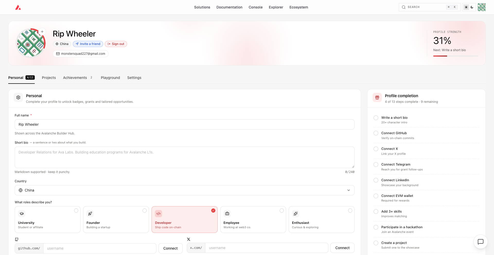
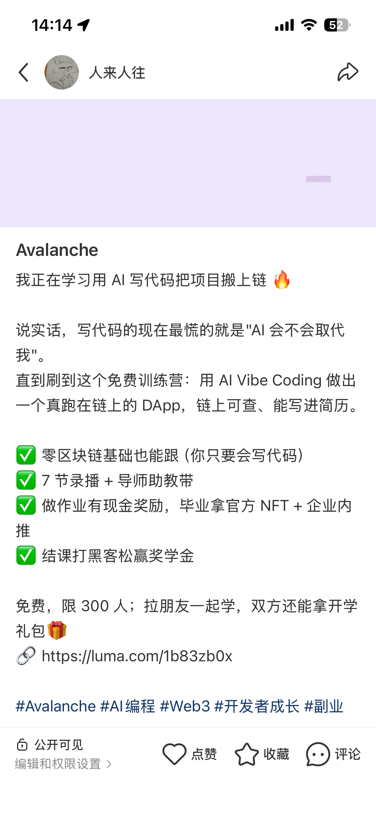

# Task 1：<第一章 Avalanche零基础入门知识>

> 对应课程：第一章 
> 截止提交：<9月6日> 24:00:00 (UTC+8)

## 任务目标

任务一：如图 

任务二：如图 

## 提交方式

1. 复制本文件到 `learn/<YourName>/task1.md`。
2. 在文件中**补充你的答案、代码或截图**。
3. 在群内接龙 已完成并附上本 PR 链接。
4. 提交 PR 到本仓库，**标题格式**：`[Task1] <YourName>`。

## 截止时间

<9月6日> 24:00:00 (UTC+8)。截止后提交的作业没有奖励。
