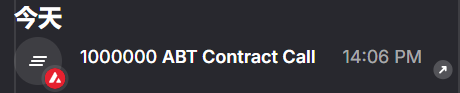

# Task 2：<第二章 Vibe Coding开发你的第一个DApp>

> 对应课程：第二章
> 截止提交：<9月6日> 24:00:00 (UTC+8)

## 任务目标

掌握 Vibe Coding 技巧，用 Scaffold-ETH 自己部署 ERC20 合约的应用

## 参考资料
Scaffold-ETH 项目开发模板
https://scaffoldeth.io/
https://github.com/scaffold-eth/scaffold-eth-2

领取 Avalanche Fuji 测试网 token
https://build.avax.network/console/primary-network/faucet

## 任务要求
把合约成功部署至Avalanche 测试网

## 提交方式
提供部署成功后截图，以及链上合约的地址

## 我的提交

- 网络：Avalanche Fuji C-Chain（Chain ID `43113`）
- ERC20：Avalanche Bootcamp Token（`ABT`）
- 合约地址：[0xab8545161af1de74ef75f1cef4a7a1ceee596d49](https://subnets-test.avax.network/c-chain/address/0xab8545161af1de74ef75f1cef4a7a1ceee596d49)
- 部署交易：[0xa03b04f32345fea7ea621811490663eb5688a5d1a5586ddf90a0625609323551](https://subnets-test.avax.network/c-chain/tx/0xa03b04f32345fea7ea621811490663eb5688a5d1a5586ddf90a0625609323551)
- 链上验证：交易回执状态为成功（`0x1`）；初始供应量 `1,000,000 ABT` 已铸造至部署账户。

### Core 部署截图

## 截止时间

<9月6日> 24:00:00 (UTC+8)
